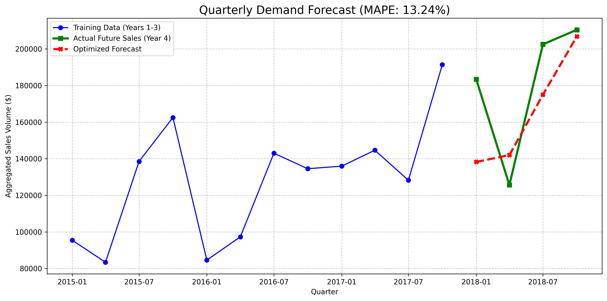

# Corporate Retail Demand Forecasting 

## Executive Summary
Engineered a Time Series forecasting architecture to predict retail sales demand, enabling data-driven inventory planning and mitigating supply chain stockouts. By aggregating volatile daily transaction data into quarterly macro-trends, I deployed an optimized Triple Exponential Smoothing (Holt-Winters) model that achieved a **13.24% Mean Absolute Percentage Error (MAPE)** over a 4-year dataset.

## The Business Problem
In retail and supply chain operations, accurate demand forecasting is critical. Overestimating demand leads to excess holding costs, while underestimating leads to stockouts and lost revenue. Raw daily transaction data is inherently noisy and highly susceptible to micro-variance (e.g., sudden promotions, varying weekends per month), making baseline predictions unreliable.

## Methodology & Architecture
## Dataset
The data used for this project is from the Kaggle Store Item Demand Forecasting dataset. It contains 5 years of daily store-item sales data.
* **Source:** [Kaggle Dataset Link](https://www.kaggle.com/datasets/rohitsahoo/sales-forecasting/data)
* **Instructions:** To replicate this project, download the archive, extract `train.csv`, and place it in the root directory before executing `forecast.py`.
1. **Data Engineering (Pandas):** Processed 4 years of Kaggle's Superstore transaction data. 
2. **The Pivot to Macro-Trends:** Initial baseline models on monthly data yielded a >20% error rate due to volatility. To extract the true underlying demand signal, I re-architected the data pipeline to aggregate sales into **Quarterly blocks**. This absorbed random noise while highlighting core cyclical buying patterns.
3. **Algorithmic Tuning (Statsmodels):** Built a hyperparameter Grid Search using `itertools` to automatically test combinations of Additive and Multiplicative trends and seasonality. 
4. **Final Model:** The algorithm identified that a **Multiplicative Trend & Multiplicative Seasonality** model performed best, accounting for the reality that holiday sales spikes scale upward as the company grows year-over-year.

## Key Results

* **Accuracy:** Reached a final optimized MAPE of 13.24% on a 12-month holdout test set.
* **Impact:** Delivered a stable, actionable 4-quarter forecast that a supply chain manager could directly use for resource allocation and warehouse capacity planning.

## Tech Stack
* **Language:** Python
* **Data Manipulation:** `pandas`, `numpy`
* **Mathematical Modeling:** `statsmodels` (ExponentialSmoothing), `scikit-learn` (Metrics)
* **Visualization:** `matplotlib`
